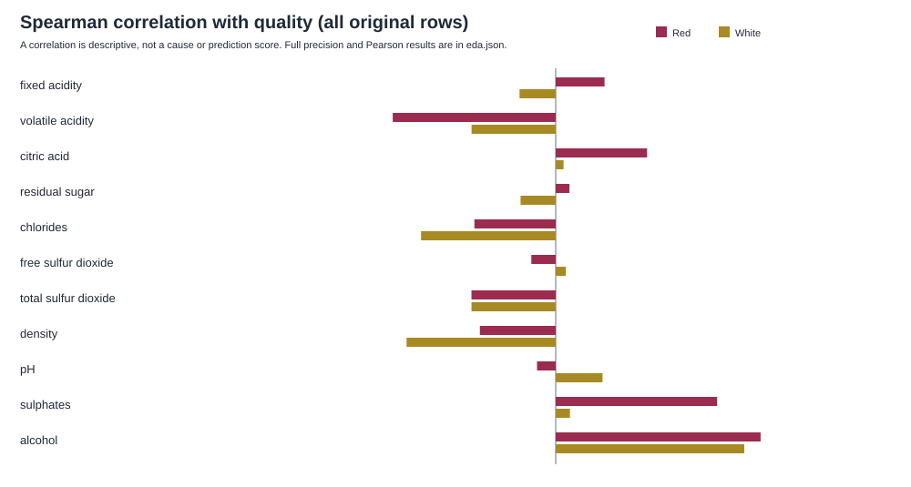

# 第二步：哪些理化指标与 quality 的关系值得验证？

**探索分析的统计结果通过复核。** 在红酒 **1,599 行**、白酒 **4,898 行**中，`alcohol` 较高的记录总体上倾向于有较高的 `quality`；其他指标与评分的关系因酒类而异。全部行保留，没有删行或改值。结果支持继续检验理化指标是否有预测信息，尚不能证明预测有效，更不能指导通过改变某种成分来提高评分。

## alcohol 与评分的关系，具体表现在哪里？

本步使用两份[原始 CSV](../../../data/)及第一步的[数据概况](../../01_数据预处理/1.1_原始数据理解与质量核验/outputs/data_profile.json)，分别分析红酒、白酒。先按 `quality` 分组，观察每组指标的中位数，再用相关系数概括全部记录之间的关系；[分析代码](src/analyze.py)与[完整统计](outputs/eda.json)保存全部 11 个指标的结果。

以红酒第 1 条数据记录为例，`alcohol=9.4`、`quality=5`：它进入红酒 5 分组。将该组 681 行的 `alcohol` 排序，取居中的值，得到中位数 9.7。对 7 分组重复同样处理，得到下表，输出位置是[完整统计](outputs/eda.json)中的 `files.red.indicators.alcohol.by_quality`。

| 红酒分组 | 记录数 | `alcohol` 中位数 |
|---|---:|---:|
| `quality=5` | 681 | 9.7 |
| `quality=7` | 199 | 11.5 |

这表示两组已经观察到的记录存在差异；不能据此推算把同一份酒的 `alcohol` 从 9.7 改为 11.5 就会提高 2 分。其他理化指标可能同时不同。

为了概括所有分值的关系，本步计算 Pearson 和 Spearman：前者描述数值间的线性关系；后者先把数值换成排序位置，同值取平均位置，再检查指标排序与评分排序是否同向。下面展示 Spearman 的共同点和差异，完整两种系数均保留在[完整统计](outputs/eda.json)。

| 指标与 `quality` 的 Spearman | 红酒：1,599 行 | 白酒：4,898 行 |
|---|---:|---:|
| `alcohol` | +0.4785 | +0.4404 |
| `volatile acidity` | -0.3806 | -0.1966 |
| `density` | -0.1771 | -0.3484 |
| `sulphates` | +0.3771 | +0.0333 |

正值表示排序总体同向，负值表示总体反向，接近零表示这种排序关系较弱。这些数不是预测准确率。`sulphates` 在红酒中的正向关系较明显，在白酒中接近零，支持继续分别研究两类酒。

图为既有的全部 11 个指标结果，数据来自[完整统计](outputs/eda.json)。它用于查看共同点与差异，不是删选特征的依据。指标之间也有关联：红酒 `free sulfur dioxide` 与 `total sulfur dioxide` 的 Spearman 为 **+0.7897**，白酒 `density` 与 `alcohol` 为 **-0.8219**。因此，某个指标与评分有关，不等于它能在其他指标之外提供额外预测信息；本项目后续仍使用全部 11 个指标。

## 极端值与同值行，是否足以改变这次观察？

不同酒类的指标分布并不相同。以 `residual sugar` 为例，中间一半记录所在的范围及最大值如下，见[完整统计](outputs/eda.json)的 `indicators.residual sugar.distribution`。

| 酒类 | 第一四分位数 | 中位数 | 第三四分位数 | 最大值 |
|---|---:|---:|---:|---:|
| 红酒，1,599 行 | 1.9 | 2.2 | 2.6 | 15.5 |
| 白酒，4,898 行 | 1.7 | 5.2 | 9.9 | 65.8 |

四分位数按排序位置作线性插值；中位数把记录分成数量相近的两半。这些值说明只看均值会遗漏分布差异。最大值离中间范围较远，但现有证据不足以认定它是错误，本步没有删除或截断它。

同值行的影响用另一次对照检查：例如红酒第 1、5 行的 12 个字段文本相同，主分析两行都计入；对照只取第 1 行。对所有组应用这条规则后，红酒对照有 **1,359 行**，白酒有 **3,961 行**，重新计算 11 个指标与 `quality` 的 Spearman。

两类酒的全部系数均未变号，也没有绝对变化达到计划预设的 **0.10**。最大绝对变化是红酒 `chlorides` 的 **0.0144**、白酒 `alcohol` 的 **0.0353**，详见[敏感性结果](outputs/eda.json)的 `sensitivity`。这支持“主要相关方向对本次同值行对照不敏感”，不代表所有异常或隐藏依赖都已排除。对照没有产生替代原始数据的清洗表。

## 后续要验证的是预测收益

本步提出的问题是：11 个指标一起使用时，是否比不看理化指标的简单预测更有用？第三步已建立固定划分与基线，第四步计划用同一验证集比较候选模型。由于 5–6 分占红酒 **82.49%**、白酒 **74.62%**，比较还需按 `quality` 查看误差，避免只用整体均值推断少见分值表现。

本步探索使用了全部原始记录，发生在第三步划分之前。因而后续最终评估集虽然尚未用于模型计分，其记录已经参与过这次探索；不能将它描述为完全未接触的数据。缺少样本 ID 与采集时间，也限制了对未来表现的判断。

---

历史核验见[原验收报告](acceptance.md)，本轮独立重算与解释边界见[报告复核记录](../../../reviews/report_review/acceptance.md)。本报告使用 Markdown 和既有 SVG，未做 Quarto 渲染。
